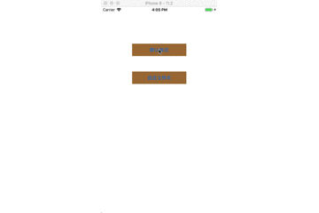
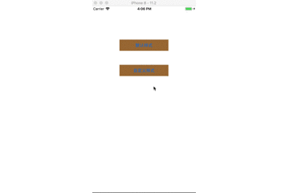

# XCDropdownTableView


[](https://travis-ci.org/fanxiaocong/XCDropdownTableView)
[](https://cocoapods.org/pods/XCDropdownTableView)
[](https://cocoapods.org/pods/XCDropdownTableView)
[](https://cocoapods.org/pods/XCDropdownTableView)
[](https://www.apple.com/nl/ios/)&nbsp;

***
|Author|小小聪明屋|
|---|---|
|E-mail|1016697223@qq.com|
|GitHub|https://github.com/fanxiaocong|
|Blog|http://www.cnblogs.com/fanxiaocong|
***


## Example
自定义下拉列表视图，采用链式编程，使用方便。

### 默认样式



```objc
/**
 *  显示默认的下拉菜单
 */
- (IBAction)didClickDefaultStyleButtonAction:(UIButton *)sender
{
    CGFloat x = CGRectGetMinX(sender.frame);
    CGFloat y = CGRectGetMaxY(sender.frame);
    CGFloat w = CGRectGetWidth(sender.frame);
    CGFloat h = CGRectGetHeight(sender.frame);
    
    XCDroupdownTableView *t = [[XCDroupdownTableView alloc] initWithFrame:CGRectMake(x, y, w, h)];
    t.defaultSelectedIndex(3).maxRows(10).rowHeight(60).fontSize(12).textAlignment(NSTextAlignmentCenter).dataSource(@[@"测试数据一", @"测试数据二", @"测试数据三", @"测试数据四", @"测试数据五", @"测试数据六"]).didSelectRowHandle(^(XCDroupdownTableView *view, UITableView *table, NSInteger row){
        /// 点击某一行的回调
        NSLog(@"点击了第 %zi 行", row);
        
    }).show();
}
```


### 自定义样式



```objc
/**
 *  显示自定义样式
 */
- (IBAction)didClickCustomStyleButtonAction:(UIButton *)sender
{
    CGFloat x = CGRectGetMinX(sender.frame);
    CGFloat y = CGRectGetMaxY(sender.frame);
    CGFloat w = CGRectGetWidth(sender.frame);
    CGFloat h = CGRectGetHeight(sender.frame);
    
    XCDroupdownTableView *t = [[XCDroupdownTableView alloc] initWithFrame:CGRectMake(x, y, w, h)];
    t.style(XCDroupdownTableViewStyleCustom).rows(10).rowHeight(80).maxRows(10).cell(^(UITableView *tableView, NSIndexPath *indexPath){
        
        /// 配置自定义的cell
        static NSString *cellIdentifier = @"XXXCell";
        XXXCell *cell = [tableView dequeueReusableCellWithIdentifier:cellIdentifier];
        if (!cell) {
            cell = [[[NSBundle mainBundle] loadNibNamed:cellIdentifier owner:nil options:nil] lastObject];
        }
        cell.numberTextLB.text = @(indexPath.row).description;
        return cell;
        
    }).didSelectRowHandle(^(XCDroupdownTableView *view, UITableView *table, NSInteger row){
        
        NSLog(@"点击了第 %zi 行", row);
        
    }).show();
}
```


</br>

***
**注意：如果当前显示的下拉列表超出屏幕的范围，会自动改变下拉列表的高度**
***

</br>


## Installation

### CocoaPods
```objc
pod 'XCDropdownTableView'
```
